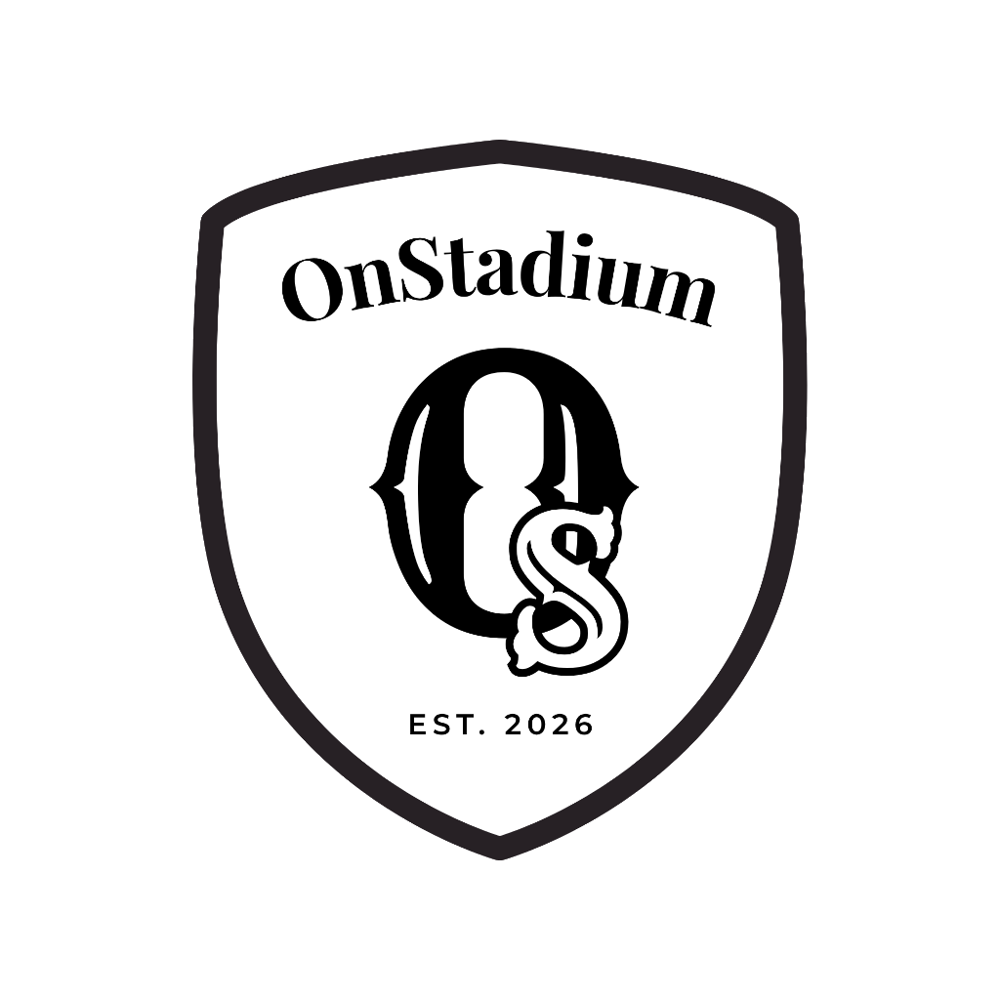

  
  <h1>🏟️ OnStadium AI</h1>
  
<strong>FIFA World Cup 2026 • GenAI Operational Intelligence Dashboard</strong>

  

    
    
    
  

---

## 🎯 1. The Vertical
**Smart Stadium Operations & Venue Management**  
*Built specifically for the massive scale of the FIFA World Cup 2026.*

## 🧠 2. Approach and Logic
**OnStadium** is a cutting-edge, GenAI-enabled operational intelligence dashboard designed for stadium staff, security personnel, and venue managers. It provides real-time, birds-eye oversight of crowd density, staff deployment, and active incidents.

### 🏆 Alignment with Problem Statement & Judging Criteria:
- **Operational Intelligence:** Replaces static maps with a dynamic, real-time dashboard.
- **Actionable AI (Gemini Integration):** The GenAI processes live IoT mock data to recommend dynamic staff re-routings and emergency protocols.
- **Enterprise Security:** The Gemini API Key is strictly secured via a dedicated Node/Express backend (`server.js`). No secrets are bundled in the frontend.
- **Strict Accessibility (A11y):** The entire dashboard conforms to WCAG guidelines with 100% semantic HTML, ARIA labels, and full keyboard navigability.
- **High Code Quality:** The frontend architecture follows a highly modular, single-responsibility component design (React best practices), validated via `oxlint` and heavily tested via `vitest`.
- **Scalability:** The architecture handles high-frequency data updates efficiently via optimized state management.

### ⚙️ Core Engineering Pillars:
* 📡 **Mock IoT Data Engine**: Simulates a live real-time data feed representing stadium congestion metrics (e.g., North Gate density, VIP Lounge capacity) updating every few seconds to emulate live turnstile and CCTV sensor data.
* 🚦 **Dynamic Thresholding**: Visual alert states (`Normal`, `Warning`, `Critical`) are logically calculated on the fly. The UI instantly transforms to grab the operator's attention using a premium Neumorphism design system.
* 🤖 **Generative AI Integration**: Powered by Google's Gemini API, the **Ops Assistant AI** intercepts critical alerts. Operators can prompt the AI in natural language to generate strategic routing, dynamic staff reassignment, and emergency evacuation protocols based on live context.
* 🛡️ **Role-Based Access Control (RBAC)**: Tailored operational views separating Command Center Admins from Field Staff.

## 🚀 3. How the Solution Works
* 📊 **Overview Dashboard**: High-level metrics (Total Attendance, Active Staff, Incidents) alongside a live, breathing feed of congestion across stadium zones.
* 🗺️ **Algorithmic Zone Maps**: A dynamic, interactive layout map algorithmically generated via SVG, scaling to different stadium blueprints.
* 👥 **Staff Deployment**: An interactive module tracking security, medical, and cleaning crews. Supports inline team-splitting and head-count reassignments on the fly.
* 💬 **Ops Assistant Chatbox**: Type *"North Gate is congested"*, and the AI engine processes the contextual stadium data to recommend actionable, immediate operations.

## 🔍 4. Assumptions Made
1. **Live Data Feed Accessibility**: During the actual event, IoT sensors and CCTV crowd analytics will supply the real-time JSON payloads that our mock engine successfully simulates.
2. **AI Response Latency**: The operational internet backbone of the stadium will provide low-latency access to the GenAI API (simulated here via a seamless frontend integration).
3. **Responsive Operations**: Staff will access the dashboard via central command center desktops or robust field tablets.
4. **Contextual Knowledge**: The GenAI model is pre-prompted with the specific architectural blueprints and emergency protocols of World Cup stadiums.

